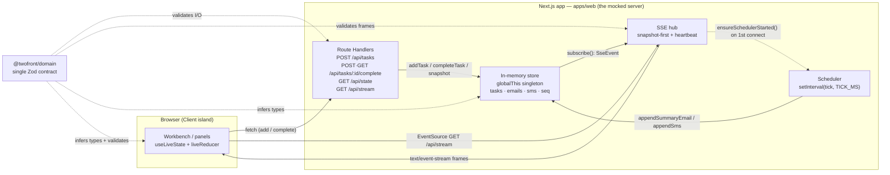
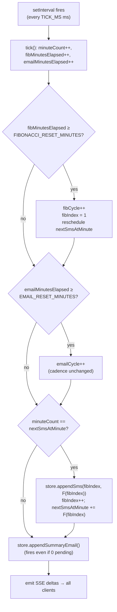

# TwoFront — Architecture

> Interviewer handoff (bonus B3). A skimmable tour of *what* this is, *how* it
> fits together, and *why* each non-obvious decision was made. Every decision
> has a defensible trade-off; the full ADR record is in
> [`./decisions/DECISIONS.md`](./decisions/DECISIONS.md).

---

## 1. Overview

TwoFront is a **single-page, real-time task manager** with a **mocked server**.
You add a task; the server immediately "emails" you, then keeps a recurring
1-minute summary email and a Fibonacci-cadence SMS reminder flowing — all
streamed live into three always-visible panels (Tasks, Emails, SMS). Completing
a task (in the app *or* from the email's action link) reflects everywhere.

The repo is split deliberately:

- **Planner in the repo root** (`/Users/.../twofront/`): the agentic build
  harness, requirements, plan, and the canonical decision log
  (`notes/Decisions Log.md`). This drives the build; it is *not* shipped.
- **Code in `tc/`**: the actual deliverable — the pnpm/Turbo monorepo. Only
  `tc/` is the public submission.

**Tech stack:** Next.js 15 (App Router) · React 19 (Server Components + Client
islands) · TypeScript **strict** · Tailwind (utilities only — ADR-0007) · Zod
on every boundary · pnpm + Turbo workspace · Playwright (Page Object Model)
for E2E.

**Monorepo layout:**

| Package | Role |
|---|---|
| `apps/web` | Next.js app: UI, Route Handlers (the mocked server), in-memory store, scheduler, SSE hub |
| `packages/domain` (`@twofront/domain`) | The single Zod contract — every type/schema; imported by server, UI, *and* E2E (ADR-0006) |
| `packages/e2e` | Playwright POM + the B1/B2 bonus specs |

---

## 2. System diagram

The mocked "server" is just Next.js Route Handlers over an in-memory
`globalThis` singleton store. One server-authoritative scheduler drives the
recurring notifications; an SSE hub fans store events out to every connected
browser. `@twofront/domain` is the single contract feeding all three layers.



The store is the only mutable state; everything else reads or mutates it
through its narrow interface. There is no DB, no message broker, no second
process — by design (see §9).

---

## 3. Request / data flow

### 3a. Add a task → immediate email → live UI

The immediate email is created **synchronously inside `store.addTask`** (not as
a deferred job) — one mutation emits both `task.created` and `email.created`
(ADR-0004 D2). The SSE hub then pushes both to every browser; the client folds
them through the pure `liveReducer` (dedupe by `seq`/`id`).

```mermaid
sequenceDiagram
  participant U as User
  participant C as Client (Workbench)
  participant API as POST /api/tasks
  participant S as Store
  participant H as SSE hub
  participant R as liveReducer

  U->>C: type title, submit
  C->>API: POST { title }
  API->>API: CreateTaskRequestSchema.parse
  API->>S: addTask(title)
  S->>S: create Task (seq=n) + immediate Email (seq=n+1)
  S-->>H: emit task.created, email.created
  API-->>C: 201 CreateTaskResponse (Zod-validated)
  H-->>R: SSE task.created (id:n)
  H-->>R: SSE email.created (id:n+1)
  R->>R: drop if seq<=lastSeq; upsert by id; sort seq-desc
  R-->>C: re-render Tasks + Emails panels
  Note over C: No optimistic temp row — the authoritative<br/>row arrives via SSE on the same in-process store.
```

### 3b. Complete from the email link (B2 — GET adapter round-trip)

The in-app Complete button uses `POST /api/tasks/:id/complete`. The email's
"Mark complete" action uses **`GET /api/tasks/:id/complete`** — the exact path
a real mail client would open from a link. Both verbs call the *same*
idempotent `store.completeTask`; only the response differs (JSON vs. a tiny
HTML confirmation page). The completion reflects back through SSE into *all*
panels — no optimistic UI mutation.

```mermaid
sequenceDiagram
  participant U as User
  participant C as Client (EmailCard)
  participant G as GET /api/tasks/:id/complete
  participant S as Store
  participant H as SSE hub

  U->>C: click "Mark complete" on the immediate email
  C->>G: GET /api/tasks/:id/complete (email-link adapter)
  G->>S: completeTask(id)
  alt task was pending
    S->>S: status=completed, completedAt set, seq bumped
    S-->>H: emit task.completed
  else already completed
    S-->>S: idempotent no-op (no seq, no event — ADR-0006 D4)
  end
  G-->>C: 200 HTML confirmation (works in any mail client)
  H-->>C: SSE task.completed
  Note over C: Task moves Pending→Completed; the email's<br/>action flips to disabled "Completed".
```

---

## 4. Scheduler & time model

The scheduler is one `setInterval(tick, config.tickMs)`. **Each tick = one
simulated minute.** Per tick, in a fixed order (the order is load-bearing):

1. advance the minute counters,
2. **Fibonacci reset** (ADR-0005): if `fibMinutesElapsed ≥
   FIBONACCI_RESET_MINUTES`, bump `fibCycle`, restart the sequence at `F(1)`,
   reschedule the next send — no SMS on the reset minute itself,
3. **Email reset** (ADR-0005): if `emailMinutesElapsed ≥
   EMAIL_RESET_MINUTES`, bump `emailCycle` (the **cadence stays 1/min** — only
   the cycle counter advances; the brief's fixed cadence is untouched),
4. **SMS** on Fibonacci-gap minutes: the sequence `1,1,2,3,5,8…` are the
   *gaps* between sends, so sends land at cumulative minutes `1,2,4,7,12,20…`,
5. **Summary email** every minute — it fires **even with zero pending tasks**
   ("no pending tasks" body), so the cadence is always provable.

The whole tick body is wrapped in try/catch + log so a thrown error can never
kill the interval.



**Why `TICK_MS` is the key senior insight.** A "1-minute summary email" and a
Fibonacci SMS cadence are, on a real clock, *untestable* in a 3-hour build and
a CI run — you cannot wait 12 real minutes to see the 5th SMS. By defining one
tick = one *simulated* minute = `TICK_MS` wall-clock ms, the **entire** cadence
is a pure function of `TICK_MS`:

- **Demo:** `TICK_MS=60000` → 1 tick = 60 s, exactly the brief's "every minute".
- **E2E:** `TICK_MS=1000` → the full schedule (summary every 1 s; SMS at 1/2/4/7/12 s;
  both reset windows) replays in seconds, **deterministically, with no hard
  sleeps** — Playwright uses web-first assertions whose budgets are derived
  from the model. Reset windows are similarly env-tunable
  (`FIBONACCI_RESET_MINUTES` / `EMAIL_RESET_MINUTES`) so a full Fibonacci
  cycle *and* its reset are both observed in one short run.

This single decision is what makes the recurring features both faithful to the
brief and provably correct in CI.

---

## 5. SSE reliability

A naive SSE feed has three demo-visible / CI-flaky bugs under compressed
`TICK_MS`. The contract (ADR-0006) closes all of them:

- **Monotonic `seq` is the ordering key**, never `createdAt`. Under fast ticks
  multiple records share a millisecond timestamp; sorting by `createdAt` would
  flicker. Every record carries a global `seq`; feeds render newest-first by
  `seq`. `createdAt` is display-only.
- **Listener-attached-*before*-snapshot + `lastSeq` dedupe.** On (re)connect
  the SSE hub `store.subscribe(...)` *first*, *then* serializes the snapshot.
  Any event emitted in the gap between snapshot capture and subscribe is thus
  delivered as a delta; the client drops any delta with `seq ≤
  snapshot.lastSeq` (the snapshot already reflects it). **No replay buffer is
  needed** — the reconnect race is closed by ordering, not by buffering.
- **Idempotent complete.** Re-completing a task is a no-op: no `seq` bump, no
  duplicate `task.completed` event. The GET email link can be opened twice
  (mail clients prefetch) without corrupting feeds.
- **Per-listener isolation + heartbeat + bounded feeds.** A throwing/closed
  listener self-prunes and can't wedge the store or other clients; a wall-time
  `:\n\n` heartbeat (independent of `TICK_MS`) keeps the connection alive; each
  feed is capped at the last 200 records so memory is bounded.

The client side is a pure reducer (`liveReducer`): snapshot seeds state;
deltas with `seq ≤ lastSeq` are dropped; surviving deltas upsert by `id`
(idempotent) and re-sort newest-first. It is unit-tested with zero DOM.

```mermaid
sequenceDiagram
  participant C as Client (EventSource)
  participant SSE as SSE hub
  participant S as Store

  C->>SSE: GET /api/stream
  SSE->>S: subscribe(onEvent)  %% listener attached FIRST
  SSE->>S: snapshot()          %% any event in the gap is now a delta
  SSE-->>C: event: snapshot (id: lastSeq)
  Note over SSE: scheduler may emit here…
  SSE-->>C: event: email.created (id: lastSeq+1)
  C->>C: seed from snapshot (lastSeq)
  C->>C: delta id<=lastSeq → drop; else upsert+bump
  loop every ~15s wall-time
    SSE-->>C: ":\n\n" heartbeat (independent of TICK_MS)
  end
  Note over C,SSE: EventSource auto-reconnects;<br/>fresh snapshot + lastSeq dedupe<br/>recovers cleanly — no replay buffer.
```

---

## 6. Server vs. Client components

`app/page.tsx` is a **Server Component**. It reads `getStore().snapshot()`
directly (the authoritative in-memory store, in-process) and passes it as the
initial state to the client island. So the **first paint is real data**, not a
loading shell and not the design's deleted client-side mock —
SSR-seeded-from-the-source-of-truth. It is marked `force-dynamic` because the
store is a live mutating singleton; a statically prerendered snapshot would be
stale.

`Workbench` (and everything reactive — `useLiveState`, the input bar, the
feeds, the ticking age clock) is a **Client island** (`"use client"`). Only the
client can hold an `EventSource`, run timers, and react to live frames. It
hydrates from the SSR-seeded snapshot and then the `EventSource` takes over;
the stream's own `snapshot` frame harmlessly re-seeds and the `seq ≤ lastSeq`
dedupe covers the handoff gap.

This split keeps the server authoritative (no client scheduler, no client mock,
no optimistic mutation — all deleted from the design port) while still getting
instant, correct first paint.

---

## 7. Decision log

Compact view; full Context/Options/Trade-off in
[`./decisions/DECISIONS.md`](./decisions/DECISIONS.md).

| ADR | Decision | One-line rationale | Trade-off accepted |
|---|---|---|---|
| 0001 | Full pnpm + Turbo workspace (not single app) | Explicit monorepo ask; `@twofront/domain` = the single Zod contract the brief probes | ~20–30 min extra scaffold |
| 0002 | SSE from a Route Handler (not polling) | "Real-time" is in the brief's first line; pairs with the server-authoritative scheduler; deterministic for E2E | Connection-lifecycle/reconnect code |
| 0003 | Port the build harness, adapt domain, drop project history | Harness must *run* on a single Next.js app, not byte-copy a 5-repo Go setup | Some inherited docs show old examples (overridden) |
| 0004 | 1 tick = 1 simulated minute = `TICK_MS`; Fibonacci = gaps; empty summary fires; BigInt core | Makes recurring features brief-faithful *and* testable; exact ~100-value unit test | Slightly richer time module + BigInt core |
| 0005 | Two independent reset configs; cadence fixed, `cycle` counters added | Mirrors both resets symmetrically; cycle fields make resets E2E-provable | Extra contract fields |
| 0006 | `seq` ordering + idempotent complete + listen-before-snapshot + bounded feeds | Eliminates timestamp-collision flake, double-emit, reconnect-race under fast ticks | ~15–20 extra lines + `seq`/`lastSeq` field |
| 0007 | Tailwind-only; zero bespoke component CSS | Brief states Tailwind as a hard requirement; non-negotiable for visual convenience | Port effort + visual-drift risk |
| 0008 | Optional extras (Pomodoro / time-controls / drag) deferred & non-authoritative | Polish at zero architectural cost *only* if non-authoritative; brief + bonuses come first | May be omitted; never blocks submission |

---

## 8. Testing strategy

- **Unit (Vitest, 99 web + 6 domain):**
  - **Fibonacci** asserted exact against ~100 known values using the **BigInt**
    core (JS `number` loses Fibonacci exactness past ~F(78), so a `number`-only
    generator would silently fail this test).
  - **Store** — add creates task + immediate email synchronously, `seq`
    monotonic, idempotent complete (no double event), 200-cap eviction,
    snapshot validates against `SnapshotSchema`, hot-reload returns the same
    singleton.
  - **Scheduler** — fake clock; summary every minute incl. empty; SMS at
    cumulative 1,2,4,7,12; Fibonacci reset restarts + bumps `fibCycle`; email
    reset bumps `emailCycle`; single-flight guard.
  - **SSE hub** — snapshot-first ordering, listener attached before snapshot,
    dead-listener pruned, frames validate against `SseEventSchema`, heartbeat.
  - **`liveReducer`** — snapshot seed, `seq ≤ lastSeq` drop, dedupe-by-id,
    newest-first ordering — the full reliability contract, zero DOM.
  - **Route handlers** — Zod-validated I/O and the `ApiError` envelope on
    every endpoint, incl. the GET email-link adapter.
- **Interaction (Vitest + jsdom):** `AddTaskBar`, `TaskRow`, `EmailCard`,
  `SmsBubble`, `Workbench`, `Toasts` — correct Server/Client boundary, no
  client scheduler, actions hit the real API paths.
- **E2E (Playwright, Page Object Model — bonuses B1 + B2):**
  - **B1 lifecycle:** add task → it appears in Pending → an *immediate* email
    referencing it arrives → on the compressed schedule a *summary* email fires
    and ≥3 Fibonacci SMS reminders carrying the task arrive newest-first.
  - **B2 complete-from-email:** add task → expand its immediate email → "Mark
    complete" (the **GET adapter**) → it moves Pending→Completed across all
    panels and the email action flips to disabled "Completed".
  - Determinism via `TICK_MS=1000` + tuned reset windows (see §4) — web-first
    assertions whose budgets are derived from the time model; **no hard
    sleeps, no weakened assertions**. The two-spec suite runs in ~22–27 s.

---

## 9. Out of scope / what I'd do next

**Deliberately not built (by design, per the brief and `REQUIREMENTS.md`):**

- **No persistence / DB.** The store is an in-memory `globalThis` singleton; a
  restart resets state. Intentional — the brief asks for a *mocked* server.
- **No auth, no real Email/SMS providers, no i18n, no deploy infra.**
- **Single instance only.** The scheduler and store assume one process; there
  is no leader election or shared bus for multi-instance.
- **ADR-0008 optional extras** (Pomodoro, time-controls display, drag-reorder)
  are scoped as the final optional, non-authoritative wave — built only if time
  remained; safe to omit. The required scope (F1–F11) + bonuses (B1/B2/B3) are
  complete and never blocked on them.

**What I'd do next (the store's narrow interface is the seam for all of it):**

- **Persistence behind the store interface** — swap the in-memory arrays for a
  repository (SQLite/Postgres) with zero change to handlers, scheduler, or SSE,
  because everything goes through the `Store` interface.
- **Provider adapters** — replace `appendSummaryEmail` / `appendSms` with real
  Email/SMS gateway adapters behind the same method signatures.
- **Multi-instance** — move the scheduler to a single leader and the SSE
  fan-out to a shared pub/sub (Redis); the `seq`/`lastSeq` reconnect contract
  already tolerates the resulting delivery semantics.
- **Auth + per-user feeds** — partition the store by user; the contract and SSE
  envelope are already typed and would extend cleanly.

---

## 10. How to run

From `tc/`:

```bash
# install (pnpm workspace)
pnpm install

# env: copy the template; defaults are demo-ready (TICK_MS=60000)
cp .env.example apps/web/.env

# dev server (http://localhost:3000)
pnpm --filter web dev

# the full demo at brief cadence (1 tick = 60s):
TICK_MS=60000 pnpm --filter web dev
#   → add a task; the immediate email is instant; the summary email and the
#     first Fibonacci SMS land ~1 simulated minute later.

# verification
pnpm -w build                 # turbo build (all packages)
pnpm -w test                  # all unit/interaction tests (domain + web)
pnpm --filter web typecheck   # strict tsc --noEmit
pnpm --filter web lint        # next lint
pnpm --filter e2e test        # Playwright POM E2E (B1 + B2), ~22–27s
```

`packages/e2e` builds and starts the production server itself with a compressed
`TICK_MS` (see `packages/e2e/playwright.config.ts`); no manual server needed
for the E2E run.
